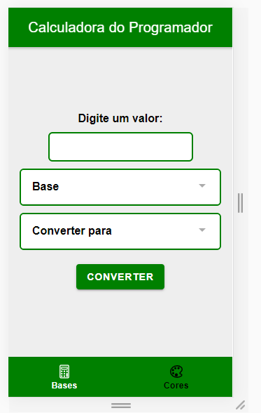
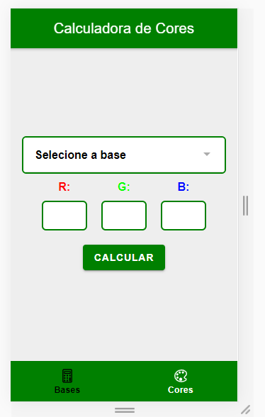

# Numeric Base Converter

This application provides a fast way to change values from a numeric base to another.

**Numeric Bases Available**
- Binary
- Decimal
- Octal
- Hexadecimal

In adition, the second tab of the application offers a page that helps you to visualize and pick a color, after typing in the inputs field

**Future implementations:**
- [x] Change only the background color of the alert
- [ ] Limit characters to only those from the specific base (base 2, 8, 10, 16 and RGB code)
- [ ] More confortable design (including animations to make things smooth)

 **Numeric Bases Tab** 
 
 
 **Color Visualizer Tab** 
 
 
 ___Observation:___
 Most elements and comments are in portuguese to reach the brazilian/portuguese dev. community more easily.
